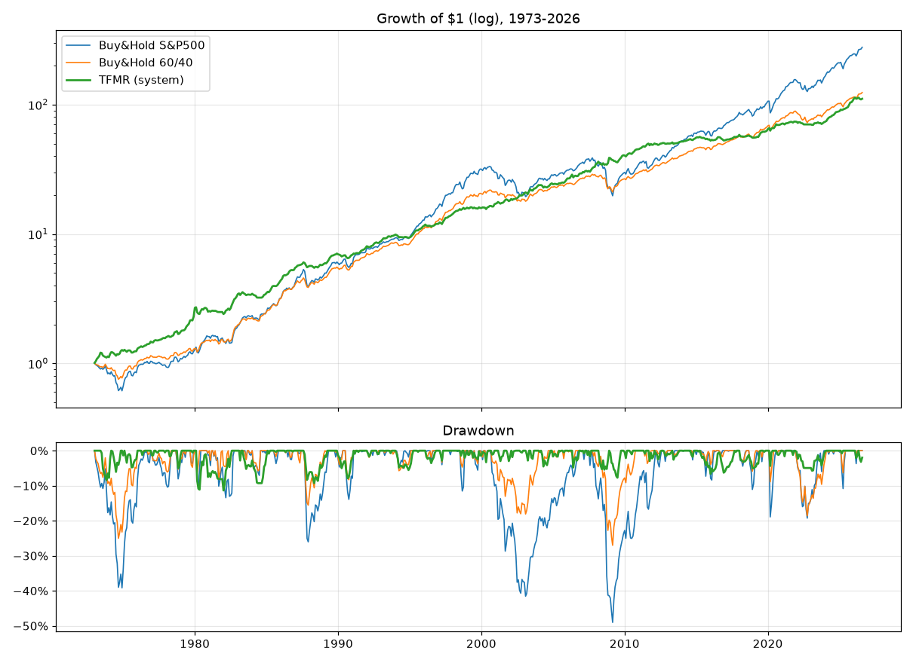
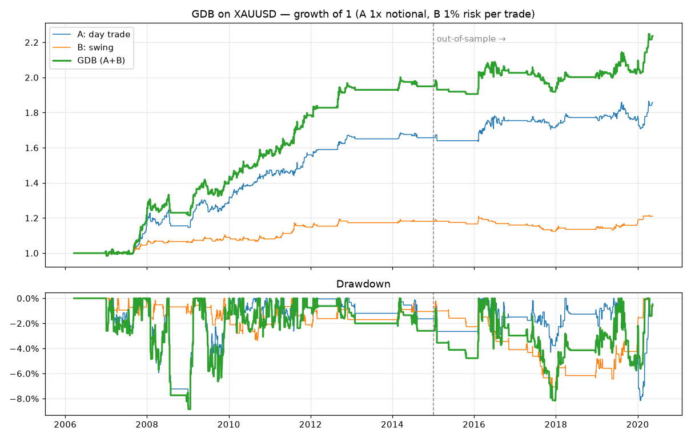

# condo-portfolio

## ระบบเทรด TFMR — Trend-Filtered Multi-asset Rotation

ระบบนี้ถือหุ้น ทองคำ และพันธบัตร แล้วตัดสินใจเดือนละครั้งด้วยตัวกรองเทรนด์ เป้าหมายคือกำไรที่สม่ำเสมอ drawdown ต่ำ และ Profit Factor มากกว่า 1 อย่างชัดเจน

### กฎการเทรด (ทำเดือนละครั้ง ตอนสิ้นเดือน)

1. แบ่งเงินเป็น 3 ส่วนเท่ากัน ให้ **หุ้นสหรัฐ (S&P 500)**, **ทองคำ** และ **พันธบัตรรัฐบาลสหรัฐ 10 ปี** อย่างละ 1/3
2. สินทรัพย์ไหนที่ราคา (แบบ total return) **สูงกว่าค่าเฉลี่ย 10 เดือน (SMA10)** ให้ถือส่วนของมันต่อ
3. สินทรัพย์ไหนที่ **ต่ำกว่า SMA10** ให้ย้ายเงินส่วนนั้นไป **พันธบัตร** ถ้าพันธบัตรยังอยู่ในเทรนด์ขาขึ้น ถ้าไม่ใช่ให้ถือ **เงินสด**
4. ไม่ใช้ leverage และไม่ short ตัวอย่าง ETF ที่ใช้ได้คือ SPY/VOO, GLD/IAU, IEF

ค่า SMA10 ตั้งไว้ตั้งแต่ก่อนทดสอบ (เป็นค่ามาตรฐานของ trend filter) **ไม่ได้ปรับให้เข้ากับข้อมูล**

### ผลทดสอบย้อนหลัง 1973-01 → 2026-08 (หักค่าธรรมเนียม 0.1% ต่อข้าง)

| ระบบ | CAGR | Max Drawdown | PF (รายเดือน) | Calmar | Sharpe |
|---|---|---|---|---|---|
| ถือ S&P500 เฉยๆ | 11.0% | **−49.0%** | 2.00 | 0.23 | 0.90 |
| ถือ 60/40 เฉยๆ | 9.4% | −27.0% | 2.36 | 0.35 | 1.14 |
| **TFMR (ระบบนี้)** | **9.2%** | **−11.4%** | **2.91** | **0.81** | **1.32** |

- ระดับไม้: เทรด 104 ไม้ ชนะ 58% และ **PF ของไม้ = 11.6** (ชนะน้อยครั้งแต่กำไรต่อไม้ใหญ่ ส่วนไม้ที่ขาดทุนถูกตัดเร็ว)
- ช่วง 12 เดือนที่แย่ที่สุดขาดทุน −9.1% (S&P500 ขาดทุน −40.9%)
- **Drawdown ลดลงประมาณ 4 เท่า** ส่วน CAGR ต่ำกว่าถือหุ้นล้วนประมาณ 2% ต่อปี



### ทดสอบว่าไม่ได้ overfit

| การทดสอบ | ผล |
|---|---|
| เปลี่ยน SMA จาก 8 ถึง 16 เดือน | CAGR 8.6–10.0%, MaxDD −11 ถึง −14%, PF 2.8–3.1 (ผลคงที่ ไม่ได้ดีแค่ค่าเดียว) |
| Out-of-sample 1881–1972 (หุ้น+พันธบัตร ไม่มีทองเพราะตอนนั้นราคาทองถูกตรึง) | MaxDD −21% (S&P −82%), PF 2.56, Sharpe 1.09 (S&P 0.62) |
| ทดสอบแยกทุก 10 ปี | PF อยู่ระหว่าง 2.5–3.3 ทุกช่วง และ MaxDD ไม่เกิน −11.4% ทุกช่วง |
| เพิ่มค่าธรรมเนียมเป็น 0.5% ต่อข้าง | CAGR 7.9%, MaxDD −14.4%, PF 2.50 (ยังใช้ได้) |
| ใช้ราคาปิดรายวันจริง ปี 1999–2018 (S&P เท่านั้น) | CAGR 6.2% เทียบถือเฉยๆ 3.1%, MaxDD −21% เทียบ −57% |

รายงานฉบับเต็มอยู่ที่ [`reports/backtest_report.md`](reports/backtest_report.md)

### ข้อจำกัดที่ต้องรู้ (สำคัญ)

- **ช่วงตลาดกระทิงแรงๆ ระบบจะชนะตลาดไม่ได้** ช่วงปี 2013–2026 ระบบได้ 6.0% ต่อปี ขณะที่ S&P500 ได้ 15.2% สิ่งที่ระบบแลกมาคือการป้องกันช่วงตลาดพัง
- ข้อมูล S&P ของ Shiller เป็น **ราคาเฉลี่ยรายเดือน** จึงหน่วงสัญญาณเพิ่ม 1 เดือน (lag=2) เพื่อตัด look-ahead bias ออก ผลนี้จึงค่อนข้าง conservative แต่ drawdown ระหว่างเดือนจริงอาจลึกกว่าตัวเลขรายเดือน
- เงินสดคิดดอกเบี้ย 0% (conservative) ในโลกจริงถือ T-bill จะได้ผลตอบแทนมากกว่านี้
- เงินปันผล S&P หลัง 2023-06 และ yield 10 ปีหลัง 2023-09 ใช้ค่าล่าสุดแทน (forward-fill) เพราะไฟล์ต้นทางหยุดอัปเดต
- ผลตอบแทนพันธบัตรคำนวณจาก yield 10 ปี (โมเดล par bond) ไม่ใช่ราคา ETF จริง
- ยังไม่ได้คิดภาษีและค่าเงิน (สำหรับนักลงทุนไทยที่ลงทุนผ่าน USD)
- **ผลในอดีตไม่รับประกันอนาคต** เอกสารนี้เป็นงานวิจัย ไม่ใช่คำแนะนำการลงทุน

### วิธีรัน

```bash
pip install -r requirements.txt
python run_backtest.py     # พิมพ์ตารางทั้งหมด และสร้าง reports/backtest_report.md + กราฟ
```

ไฟล์ในโปรเจกต์:

- `trading_system/data.py` — โหลดข้อมูล สร้าง total return ของหุ้น พันธบัตร และทอง
- `trading_system/strategies.py` — กฎของระบบ (`tfmr`) และ benchmark
- `trading_system/backtest.py` — backtester (มีค่าธรรมเนียมและ lag) และ metrics (CAGR, MaxDD, PF, Calmar ฯลฯ)
- `data/` — ข้อมูลสาธารณะจาก github.com/datasets (Shiller S&P500, gold) และ S&P500 รายวันจากแพ็กเกจ `arch`

สัญญาณล่าสุด (ข้อมูลถึง 2026-08): หุ้นอยู่ในเทรนด์ ถือ 33% / ทองต่ำกว่า SMA10 ย้ายไปพันธบัตร / พันธบัตร 67%

---

## ระบบที่ 2: GDB — Gold Daily Breakout (XAUUSD CFD ระยะสั้น)

ระบบเทรดทองระยะสั้นบนแท่ง Daily ใช้ข้อมูลจริงของ Oanda XAU/USD (แท่ง 1 นาที รวมเป็นแท่งรายวัน) ช่วง 2006-03 ถึง 2020-05

**วิธีทดสอบ:** เลือกพารามิเตอร์จากข้อมูลปี 2006–2014 เท่านั้น และกันข้อมูลปี 2015–2020 ไว้ทดสอบ out-of-sample โดยไม่แตะเลย
**ต้นทุนที่คิด:** spread 0.35 USD/oz, slippage 0.10 ต่อครั้ง, swap ฝั่ง long −4% ต่อปี (คิดสามเท่าในวันพุธ)
**การ fill:** เมื่อ SL กับ TP โดนในแท่งเดียวกัน ถือว่าโดน SL ก่อน และเมื่อราคา gap ผ่าน SL จะ fill ที่ราคาเปิด

### กฎ (ใช้ฝั่ง Long เท่านั้น และเทรดเฉพาะเมื่อราคาปิดเมื่อวานอยู่เหนือ SMA200 รายวัน)

- **โมดูล A (Day trade):** ตั้ง Buy Stop ที่ `Open วันนี้ + 0.7 × (High − Low ของเมื่อวาน)` แล้วปิดทุกออเดอร์ก่อนจบวัน จึงไม่เสีย swap ขนาดสัญญา = 1 เท่าของ equity
- **โมดูล B (Swing):** เมื่อราคาปิดทะลุ High สูงสุดของ 20 วันก่อนหน้า ให้ Buy ตั้ง SL = 2×ATR(14) และใช้ Trailing stop = High สูงสุดตั้งแต่เข้า − 2×ATR ความเสี่ยงไม้ละ 1% ของ equity

### ผลทดสอบ

| ช่วง | CAGR | MaxDD | PF | Sharpe | จำนวนเทรด |
|---|---|---|---|---|---|
| In-sample 2006–2014 | 7.9% | −8.9% | 1.71 | 1.14 | 437 |
| **Out-of-sample 2015–2020** | **2.6%** | **−8.2%** | **1.25** | 0.46 | 260 |
| ทั้งช่วง 2006–2020 | 5.9% | −8.9% | 1.53 | 0.90 | 697 |
| ถือทองเฉยๆ (ทั้งช่วง ไม่คิด swap) | 8.3% | −44.7% | – | 0.52 | – |

- **PF ยังเป็นบวกใน out-of-sample** ทั้งโมดูล A (1.22) และโมดูล B (1.40) และเป็นบวกทุกค่า k ตั้งแต่ 0.5 ถึง 1.0 และทุกค่า N ตั้งแต่ 10 ถึง 55
- **ถ้าขยายขนาดไม้:** A 3 เท่า + B 3% ได้ CAGR 17% แต่ MaxDD −25% (สัดส่วนกำไรต่อ DD เท่าเดิม)
- **spread มีผลมาก:** ถ้า spread เป็น 0.80 PF out-of-sample เหลือ 1.12 จึงควรใช้โบรกที่ spread ต่ำ



### ความจริงที่ต้องรู้ก่อนใช้

- **Edge อ่อนลงชัดเจนหลังปี 2014** PF จาก 1.71 เหลือ 1.25 และ CAGR ที่ขนาดไม้ 1 เท่าเหลือแค่ 2.6% ต่อปี
- **ปีที่ทองขึ้นแรง ระบบได้น้อยกว่าถือทองเฉยๆ มาก** เช่นปี 2017 ระบบ −5% ขณะที่ทอง +12.5% จุดเด่นของระบบคือหลบช่วงทองขาลง (ปี 2013 ทอง −29% ระบบ −1%)
- **ข้อมูลถึงแค่ 2020-05** ยังไม่ครอบคลุมตลาดทองช่วงปี 2020–2026 ควร export ข้อมูลใหม่จาก MT5 มาทดสอบซ้ำ
- `mt5/GDB_XAUUSD.mq5` เป็น EA ที่แปลงมาจากโค้ดทดสอบ **ยังไม่ได้ compile หรือรันใน MetaTrader** ต้องทดสอบใน Strategy Tester และบัญชี Demo อย่างน้อย 2–3 เดือนก่อนใช้เงินจริง และต้องตั้ง `A_CloseHour` ให้ตรงกับเวลาเซิร์ฟเวอร์ของโบรก

```bash
python run_gold.py      # สร้าง reports/gold_report.md + reports/gold_equity.png
```
