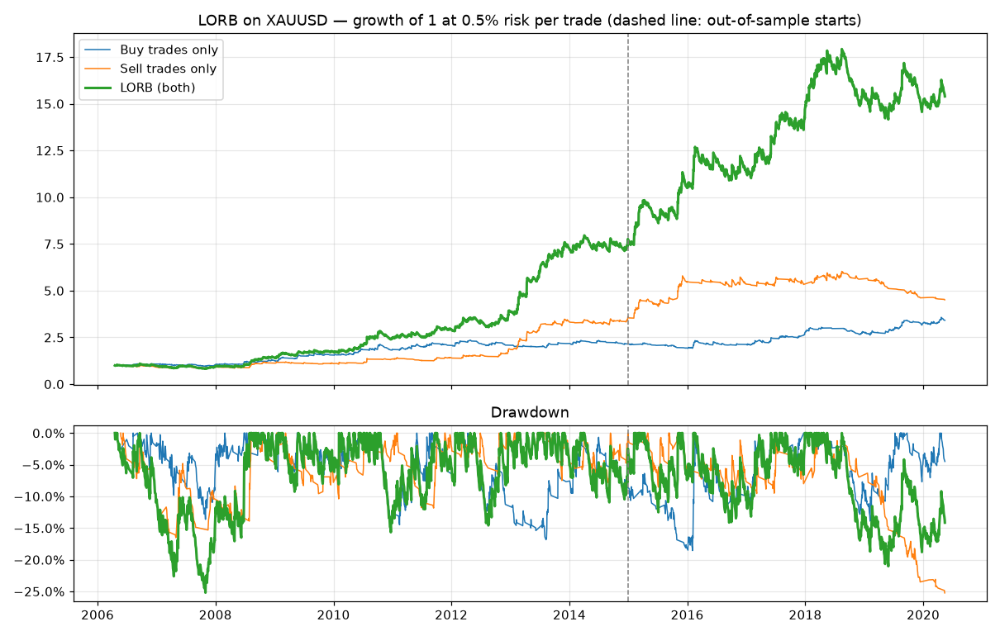

# LORB — London Opening-Range Breakout (XAUUSD, intraday, buy & sell)

Oanda XAU/USD 1-minute bars 2006-03 → 2020-05, London time. Costs per fill 0.5625 bp of price (≈ $0.35 spread + $0.05 slippage at $4,000 gold). No overnight positions → no swap.

## Main result (0.5% risk per trade)

|                         |   All trades |   All PF | All win%   |   Buy trades |   Buy PF | Buy win%   |   Sell trades |   Sell PF | Sell win%   |   Avg R | CAGR   | MaxDD   |   CAGR/MaxDD |
|:------------------------|-------------:|---------:|:-----------|-------------:|---------:|:-----------|--------------:|----------:|:------------|--------:|:-------|:--------|-------------:|
| In-sample 2006-2014     |         1911 |     1.32 | 27%        |         1033 |     1.22 | 26%        |           878 |      1.44 | 28%         |   0.232 | 26.5%  | -25.2%  |         1.05 |
| Out-of-sample 2015-2020 |         1180 |     1.19 | 29%        |          642 |     1.23 | 31%        |           538 |      1.14 | 27%         |   0.131 | 13.7%  | -21.0%  |         0.65 |
| Full 2006-2020          |         3091 |     1.27 | 28%        |         1675 |     1.22 | 28%        |          1416 |      1.32 | 28%         |   0.194 | 21.4%  | -25.2%  |         0.85 |

## Robustness: neighbouring settings (PF per side)

|                  |   IS Buy PF |   IS Sell PF |   OOS Buy PF |   OOS Sell PF |
|:-----------------|------------:|-------------:|-------------:|--------------:|
| system           |        1.22 |         1.44 |         1.23 |          1.14 |
| range from 08:00 |        1.22 |         1.34 |         0.96 |          1.09 |
| no trend filter  |        1.11 |         1.35 |         1.36 |          1.09 |
| trend SMA50      |        1.18 |         1.42 |         1.2  |          1.01 |
| trend SMA200     |        1.17 |         1.41 |         1.28 |          1.11 |
| exit 16:00       |        1.23 |         1.42 |         1.2  |          1.25 |
| range 45 min     |        1.13 |         1.51 |         1.2  |          1.18 |
| range 90 min     |        1.25 |         1.4  |         1.19 |          1.21 |

## Cost stress (out-of-sample)

|                                               |   OOS Buy PF |   OOS Sell PF |   OOS Avg R |
|:----------------------------------------------|-------------:|--------------:|------------:|
| 0.25 bp/fill (≈ $0.20 round trip at $4,000)   |         1.27 |          1.19 |       0.156 |
| 0.5625 bp/fill (≈ $0.45 round trip at $4,000) |         1.23 |          1.14 |       0.131 |
| 0.75 bp/fill (≈ $0.60 round trip at $4,000)   |         1.13 |          1.11 |       0.086 |
| 1.0 bp/fill (≈ $0.80 round trip at $4,000)    |         1.1  |          1.07 |       0.063 |
| 1.5 bp/fill (≈ $1.20 round trip at $4,000)    |         1.04 |          0.97 |       0.004 |

## Calendar years (0.5% risk)

|      |   Buy PF |   Sell PF | Return   |
|-----:|---------:|----------:|:---------|
| 2006 |     1.31 |      0.69 | -2.5%    |
| 2007 |     0.92 |      1.03 | -4.9%    |
| 2008 |     1.55 |      1.52 | 52.0%    |
| 2009 |     1.53 |      0.93 | 21.3%    |
| 2010 |     1.31 |      1.85 | 45.2%    |
| 2011 |     1.23 |      1.18 | 17.7%    |
| 2012 |     1.03 |      1.78 | 32.5%    |
| 2013 |     1.19 |      2.31 | 86.8%    |
| 2014 |     0.99 |      1.22 | 6.7%     |
| 2015 |     0.66 |      1.97 | 36.9%    |
| 2016 |     1.24 |      0.95 | 7.3%     |
| 2017 |     1.56 |      1    | 29.5%    |
| 2018 |     1.03 |      1.15 | 5.9%     |
| 2019 |     1.4  |      0.44 | -3.6%    |
| 2020 |     1.24 |      0.36 | 2.7%     |

## Risk per trade vs return / drawdown (full period)

|                  | CAGR   | MaxDD   |   CAGR/MaxDD |
|:-----------------|:-------|:--------|-------------:|
| risk 0.25%/trade | 10.7%  | -13.2%  |         0.81 |
| risk 0.50%/trade | 21.4%  | -25.2%  |         0.85 |
| risk 1.00%/trade | 42.0%  | -44.7%  |         0.94 |

